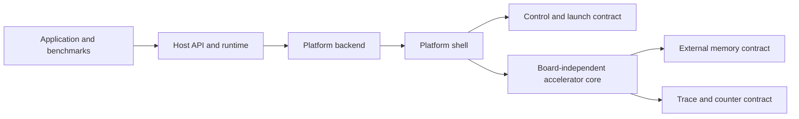

# FPGA Platform Strategy and End-to-End Roadmap

**Status**: Approved planning baseline
**Last updated**: 2026-08-20
**Task ledger**: [tasks.md](../../specs/001-open-riscv-gpgpu/tasks.md)

This document defines the target architecture and the implementation sequence
for taking the RISC-V GPGPU from functional models to reproducible execution on
real FPGA systems. It is the canonical source for platform scope. Detailed
interface values remain in the ISA, AXI, HLS, and software contracts.

## 1. Outcomes

The project will deliver:

1. A board-independent accelerator core with a stable kernel, control, memory,
   and observability contract.
2. A Kria KV260/KR260 shell used for bring-up and the first physical
   end-to-end validation.
3. An AMD Alveo U55C shell as the final scale-out target.
4. A common validation path across SystemC, HLS/RTL, Kria, and Alveo.
5. Reproducible comparisons covering correctness, absolute performance,
   scalability, resource efficiency, and energy.
6. A repository containing only canonical source, required dependencies,
   reproducible flows, and curated evidence.

Passing synthesis or reading an AXI register is not end-to-end success. A
hardware gate passes only when a kernel is loaded, launched, completed without
a fault, copied back, and checked against the expected result.

## 2. Platform Roles

| Platform | Role | Host transport | External memory | Current access |
|---|---|---|---|---|
| SystemC | Functional reference and architectural exploration | In-process API | Functional model | Available |
| HLS/RTL | Synthesizable microarchitecture and protocol verification | Testbench/AXI VIP | Simulated AXI memory | Available |
| Kria KV260/KR260 | Bring-up and first physical proof | ARM PS, UIO/CMA/dma-buf | PS DDR through AXI HP/HPC | Available |
| Alveo U55C | Final scalable FPGA target | PCIe host; XRT or RTL-kernel shell | HBM pseudo-channels | Access planned |
| NVIDIA GPU with eGPU | Research contrast for programmability and observability | CUDA/eGPU runtime | GPU memory | Available |

Kria-specific PS integration and Alveo-specific PCIe/HBM integration are
platform shells. Neither may leak into the accelerator-core execution
semantics.

## 3. Architecture Boundaries

### 3.1 Host API and runtime

Owns kernel selection, launch geometry, arguments, buffers, synchronization,
errors, and result validation. It must not expose `/dev/mem`, XRT, physical
addresses, or board-specific register offsets to applications.

### 3.2 Platform backend

Implements allocation, transfer, image loading, launch, completion, and counter
collection for a platform. Kria and Alveo use separate backends behind one
runtime interface instead of distributed `#ifdef` blocks.

### 3.3 Platform shell

Adapts board clocks, resets, host transport, interrupts, address translation,
and external memory ports to the common accelerator contract.

### 3.4 Accelerator core

Owns instruction execution, warp scheduling, divergence/reconvergence,
barriers, shared memory, cache behavior, faults, and architectural counters.
The baseline ISA is RV32IMF little-endian plus the minimum documented custom
SIMT operations. RVV and a production LLVM target do not block the first
physical gate.

### 3.5 External memory and observability

Program storage, initial contexts, global data, and result buffers use one
canonical logical address-space contract. Platform shells map that contract to
Kria DDR or Alveo HBM. Every execution emits a common signature containing
kernel/config hashes, launch geometry, completion/fault state, output digest,
instructions, stalls, divergence/barriers, and memory traffic.

## 4. Contracts to Freeze Before Feature Work

The following contracts must each have one canonical definition and generated
or checked mirrors in software, HLS, and platform tooling:

- RV32IMF and custom-SIMT instruction encodings;
- kernel ABI, argument registers, stack, return, thread context, and ELF rules;
- control/status registers and launch/completion handshake;
- program, context, heap, shared-memory, result, and telemetry regions;
- capacity parameters and target profiles;
- trace/counter schema and fault taxonomy.

The current abstract `ID/CTRL/STATUS` map and the HLS-generated AXI-Lite banks
are not assumed to be equivalent. Task T098 must reconcile them before the
driver-to-hardware path can be considered conformant.

### 4.1 Performance and Interface Decisions

Interface selection follows the measurable question gates in the
[performance strategy](performance_strategy.md). AXI4-Lite is the default for
low-rate control and bounded counter snapshots, not for program, data, result,
or trace traffic. Full AXI4 and managed buffers/DMA carry bulk transfers;
ready/valid streams connect internal dataflow stages.

The current bottleneck hypothesis is the one-outstanding-per-CU, N:1 memory
request path, not the control bus. T096a-T096g must define the workload
envelope, measure control overhead and memory ceilings, test concurrency/cache
alternatives, map platform memory topology, and publish a compute/memory
balance model before T098-T105 freeze or scale the implementation.

## 5. Quantitative Gates

| Gate | Acceptance criterion |
|---|---|
| Integer/control/memory correctness | Bit-exact final state and output |
| Floating-point correctness | Explicit per-operation ULP tolerance |
| Model/HLS event parity | Exact instruction and transaction counts unless a documented deviation exists |
| FPGA timing | Post-route WNS greater than or equal to 0 |
| FPGA implementation | No critical DRC violations |
| Resource headroom | At most 70% of the limiting resource for the selected baseline |
| Design-space exploration | Reproducible 2/4/8-CU sweep |
| Calibrated model accuracy | Median microbenchmark estimate error at most 15% against hardware |
| Statistical evaluation | Warmups plus at least 30 measured samples; median, p95, and dispersion reported |

An exception requires a recorded rationale and mitigation. It must not be
converted into an implicit PASS.

## 6. Delivery Sequence

### Stage A: Rebaseline and freeze contracts (T093-T100)

Audit task evidence, update the specification and plan, classify repository
content, define architecture boundaries, freeze ISA/ABI and CSR/memory maps,
create generated configuration profiles, and set measurable budgets.

### Stage B: Align models and microarchitecture (T101-T105)

Create a common trace contract, select the normative SystemC binary path,
align the HLS core, run C/RTL and AXI protocol verification, then select the
Kria baseline from measured design-space exploration.

### Stage C: Prove Kria end to end (T106-T111)

Conform the Kria shell and driver to the frozen contract, establish a coherent
DDR transport, package all deployment artifacts, and execute functional and
SIMT gates on physical hardware. Rodinia evidence follows only after those
correctness gates pass.

### Stage D: Select and implement the U55C shell (T112-T117)

Timebox XRT/xclbin and RTL-kernel prototypes, choose one through an ADR, map the
logical memory contract onto HBM, implement the selected host backend, and run
the same physical gates and scalability sweeps on U55C.

### Stage E: Evaluate and prepare publication (T118-T123)

Freeze workloads and datasets, use one statistical harness, compare models,
Kria, and U55C, and generate publication artifacts from raw data. Study eGPU
separately before deciding whether a defensible common eBPF workload exists.

### Stage F: Clean and release (T124-T128)

Canonicalize entrypoints, pin external dependencies, remove obsolete or
generated content, synchronize documentation, define CI/hardware gates, and
prove the release from a clean clone.

## 7. Alveo U55C Selection

Alveo U55C is no longer discarded. The project will compare two bounded
integration prototypes:

| Option | What is evaluated |
|---|---|
| Vitis acceleration with XRT/xclbin | HBM mapping, host API fit, packaging, emulation, profiling, build/debug effort |
| RTL kernel | Control over RTL and interfaces, PCIe integration effort, maintainability, timing, and debug |

The comparison ends with one selected route. Maintaining two production shells
would duplicate verification and is out of scope.

## 8. eGPU Research Note

[eGPU](https://github.com/eunomia-bpf/eGPU) translates eBPF to NVIDIA PTX and
injects observability code into live GPU kernels. It is not an equivalent
standalone GPGPU implementation. Task T121 will determine whether to:

- define a common eBPF-to-RV32IMF software path;
- use eGPU to instrument CUDA versions of shared workloads; or
- keep the comparison methodological rather than claim direct speedup.

No eGPU performance comparison enters the publication until the workload,
measured region, hardware, software revisions, and validity limits are fixed.

## 9. Evidence States

Project status uses these terms consistently:

| State | Meaning |
|---|---|
| Planned | Approved task with no implementation claim |
| Implemented | Source exists and passes its scoped local checks |
| Simulated | Required functional/cosimulation gate passed |
| Synthesized | HLS or FPGA implementation completed with reports |
| Validated on hardware | Physical kernel execution and result verification passed |
| Invalid evidence | Existing artifact does not satisfy the stated gate |
| Superseded | Replaced by a newer task or decision |

The existing Kria report proves AXI-Lite access but skipped DDR and kernel
execution. It is bring-up evidence, not an end-to-end hardware validation.

## 10. Repository Rules

- Specs define requirements, sequencing, and task ownership.
- Architecture docs own interfaces and ADRs.
- Component READMEs explain only their local build and usage.
- Generated builds, raw logs, and bitstreams stay untracked.
- Curated evidence includes command, commit, configuration, tool/device
  versions, artifact hashes, raw-log reference, and explicit pass criteria.
- External dependencies remain outside Git but are pinned by URL, commit, and
  license in the reproducibility package.
- A skipped prerequisite is reported as a skip or unmet gate, never as PASS.

## 11. Related Decisions

- [ADR-0001: Platform Roles and Portable Core](decisions/0001-platform-roles.md)
- [ADR-0002: Baseline ISA and Kernel ABI](decisions/0002-baseline-isa-abi.md)
- [ADR-0003: Canonical CSR and Memory Contract](decisions/0003-csr-memory-contract.md)
- [ADR-0004: Kria Memory Transport](decisions/0004-kria-memory-transport.md)
- [ADR-0005: Alveo U55C Shell Selection](decisions/0005-alveo-shell-selection.md)
- [ADR-0006: Control, Data, and Trace Plane Separation](decisions/0006-control-data-plane-separation.md)